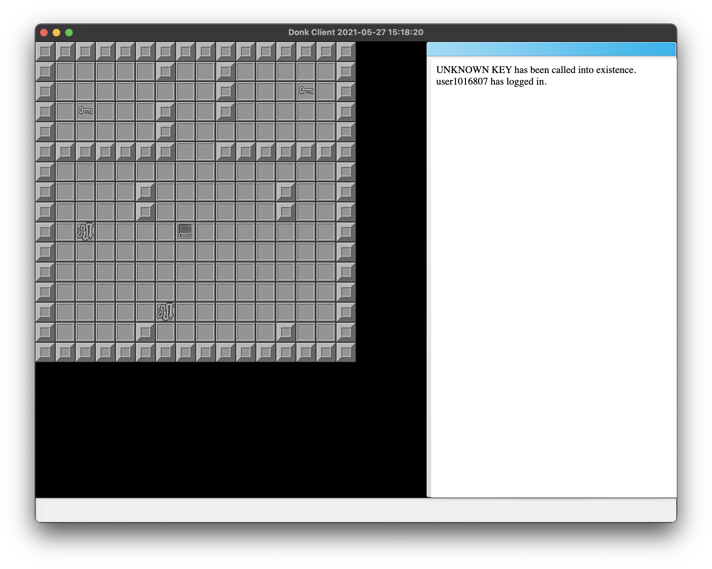

# Pollux

Pollux is the graphical client and server binary used for BYOND projects
transpiled for use with the Donk API.

It attempts to abstract the various pieces of the client into "manager" APIs
which may be implemented depending on the specific combination of platform
features needed. For example, if the interface is being rendered via SDL2, and
uses the Gwork project as a GUI, the backend `gwork_sdl2` implements the
UIManager and RenderManager in order to manage coupling between the renderer and
UI and abstract it from the core state manager.

Since the official BYOND client is tightly integrated with the browser controls
and renderer baked into Windows (or provided by Edge when available), a
full-blown browser implementation is required for Pollux. In this case we use
the Chromium Embedded Framework, and attempt to abstract away as much of the
detail required to use it as possible. The CEF static library is, so far, the
only dependency in Donk Project that is not built from source in Bazel. Rather,
nightly builds supplied by Spotify are downloaded and exposed as dependencies.

The relevant targets are:

- `@pollux//pollux/server:main` is the server binary.
- `@pollux//pollux/client:PolluxClientMac` is the macOS client binary.
- Windows support coming soon, as the architecture is already in place for it.

## Screenshots

This screenshot demonstrates basic map rendering, and Chromium Embedded
Framework receiving events from the server-side interpreter and rendering their
contents. This also demonstrates the use of high-DPI rendering, when available,
with the headless renderer.
